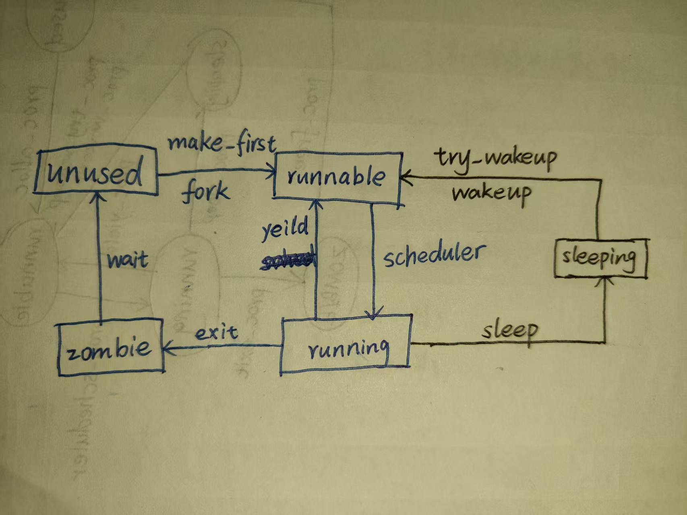

# LAB-6: 单进程走向多进程——进程调度与生命周期

**前言**

经过lab-4的初创和lab-5的完善, proczero已经比较成熟了

从零到一很缓慢, 但是从一到多很快：可以"复制proczero"来产生更多进程

产生更多进程后, 需要解决新产生的两个问题

- 多个进程会竞争CPU资源 (之前几乎由proczero独占)

- 进程新生与死亡的问题 (之前的proczero诞生后永不死亡)

因此, 本次实验主要关注两个主题: 进程调度 + 生命周期

## 代码组织结构

```
ECNU-OSLAB-2025-TASK
├── LICENSE        开源协议
├── .vscode        配置了可视化调试环境
├── registers.xml  配置了可视化调试环境
├── .gdbinit.tmp-riscv xv6自带的调试配置
├── common.mk      Makefile中一些工具链的定义
├── Makefile       编译运行整个项目
├── kernel.ld      定义了内核程序在链接时的布局
├── pictures       README使用的图片目录 (CHANGE, 日常更新)
├── README.md      实验指导书 (CHANGE, 日常更新)
└── src            源码
    ├── kernel     内核源码
    │   ├── arch   RISC-V相关
    │   │   ├── method.h
    │   │   ├── mod.h
    │   │   └── type.h
    │   ├── boot   机器启动
    │   │   ├── entry.S
    │   │   └── start.c
    │   ├── lock   锁机制
    │   │   ├── spinlock.c
    │   │   ├── sleeplock.c (TODO, 实现睡眠锁)
    │   │   ├── method.h (CHANGE)
    │   │   ├── mod.h (CHANGE, 增加头文件)
    │   │   └── type.h (CHANGE)
    │   ├── lib    常用库
    │   │   ├── cpu.c
    │   │   ├── print.c
    │   │   ├── uart.c
    │   │   ├── utils.c
    │   │   ├── method.h
    │   │   ├── mod.h
    │   │   └── type.h
    │   ├── mem    内存模块
    │   │   ├── pmem.c
    │   │   ├── kvm.c (TODO, kvm_init从单进程内核栈初始化到多进程内核栈初始化)
    │   │   ├── uvm.c
    │   │   ├── mmap.c
    │   │   ├── method.h
    │   │   ├── mod.h
    │   │   └── type.h
    │   ├── trap   陷阱模块
    │   │   ├── plic.c
    │   │   ├── timer.c (TODO, 新增timer_wait函数, 增加时钟中断调度逻辑)
    │   │   ├── trap_kernel.c (TODO, 增加时钟中断调度逻辑)
    │   │   ├── trap_user.c (TODO, 增加时钟中断调度逻辑)
    │   │   ├── trap.S
    │   │   ├── trampoline.S
    │   │   ├── method.h (CHANGE, 增加timer_wait函数声明)
    │   │   ├── mod.h
    │   │   └── type.h
    │   ├── proc   进程模块
    │   │   ├── proc.c (TODO, 核心工作)
    │   │   ├── swtch.S
    │   │   ├── method.h (CHANGE)
    │   │   ├── mod.h
    │   │   └── type.h (CHANGE)
    │   ├── syscall 系统调用模块
    │   │   ├── syscall.c (CHANGE, 支持新的系统调用)
    │   │   ├── sysfunc.c (TODO, 实现新的系统调用)
    │   │   ├── method.h (CHANGE)
    │   │   ├── mod.h
    │   │   └── type.h (CHANGE)
    │   └── main.c (CHANGE)
    └── user       用户程序
        ├── initcode.c (CHANGE)
        ├── sys.h
        ├── syscall_arch.h
        └── syscall_num.h (CHANGE)
```

**标记说明**

**NEW**: 新增源文件, 直接拷贝即可, 无需修改

**CHANGE**: 旧的源文件发生了更新, 直接拷贝即可, 无需修改

**TODO**: 你需要实现新功能 / 你需要完善旧功能

## 准备工作: 引入进程数组

首先关注进程结构体的变化 (in `kernel/proc/type.h`), 我们新增了若干字段:

- `char name[16]` 进程名称, 服务于debug

- `spinlock_t lk` 自旋锁, 用于保证共享字段的访问和修改不被打断

- `enum proc_state state` 共享字段1: 进程状态 (共5种), 与生命周期相关

- `struct proc *parent` 共享字段2: 当前进程的父进程, 进程复制过程包含父子关系的建立

- `int exit code` 共享字段3: 进程的退出状态 (类似函数用返回值来代表执行情况)

- `void *sleep_space` 共享字段4: 进程睡眠的位置 / 进程等待的资源 (与sleeping状态相关)

共享字段的含义: 进程B可能会访问/修改进程A的共享字段, 进程A的非共享字段只有自己关心

因此, 为了保证状态访问/修改的原子性, 访问进程共享字段时通常需要先持有自旋锁

我们在`kernel/proc/proc.c`中定义了一个进程数组`proc_list`, 最多支持**N_PROC**个进程同时存在

很自然的, 定义进程数组后, **proczero**将从元素变成指向元素的指针

另外, 进程数组中的每一个进程都应该拥有一个全局的标识符PID, 我们维护一个全局的**global_pid**来支持这一点

`proc_list`和之前遇到的`mmap_mmap_region_node_t node_list[N_MMAP]`都是资源仓库

请你先完成下面三个函数, 实现仓库的有序管理

- `proc_init` 对系统资源(static变量)进行初始化赋值 (其中**global_pid**建议设置为1)

- `proc_alloc` 从资源仓库申请一个空闲的进程结构体, 完成通用初始化逻辑, 上锁返回 (注意: p->ctx.ra应该设置为`proc_return`)

- `proc_free` 向资源仓库释放一个进程结构体(及其包含的资源)

之后, 你需要改写之前的 `proc_make_first`, 主要是以下两点:

- 可以通过`proc_alloc`申请**proczero**, 删去一些不必要的复制

- 只需要完成**proczero**的初始化并解锁即可, 不应直接调用`swtch`逻辑

最后, 在 `kernel/mem/kvm.c`的`kvm_init`中, 需要将内核栈映射从单个拓展到多个

## 基于循环扫描的进程调度

`main`函数做完所有初始化后, 会执行`proc_scheduler`启动调度器, 随后永不返回

因此, 我们可以这样描述CPU-0和CPU-1最初执行流做的事情 (下面称他们为原生进程0和原生进程1):

- 原生进程0和原生进程1从0x80000000开始执行, 经过`entry.S -> start.c -> main.c`进入main函数

- 原生进程0完成了系统资源初始化(包括proczero的准备) + CPU-0核心初始化, 原生进程1完成了CPU-1核心初始化

- 原生进程0和原生进程1进入调度器死循环, 从初始化者变成调度选择与缓冲者

**结合proc_sched和proc_scheduler来说明进程调度的过程:**

- 原生进程执行调度器逻辑(`proc_scheduler`), 循环扫描进程数组, 找到一个处于RUNNABLE状态的用户进程A

- 通过`swtch(原生进程上下文, 用户进程A上下文)`完成第一次执行流切换(`swtch`): 原生进程->用户进程A

- 原生进程A使用`proc_sched`主动/被动释放CPU, 完成第二次执行流切换(`swtch`): 用户进程A->原生进程

- 原生进程继续扫描进程数组, 找到新的处于RUNNABLE状态的用户进程B......

**注意: 当原生进程执行时, CPU->proc设为NULL; 用户进程A执行时, CPU->proc设为用户进程A**

进程调度的算法非常简单, 但是切换逻辑非常严密和精巧, 值得你细细琢磨 

仔细考虑调度器在进程调度中的选择与缓冲作用 (用户进程A切换到用户进程B需要两次上下文切换)

理解上述逻辑后请完成 `proc_sched` 和 `proc_scheduler` 函数

## 基于时钟的抢占式调度

完成上面的事情后, 我们发现缺少一种强制性手段来打断长进程的执行, 可能导致排在后面的短进程长时间得不到响应

出于实现简单的考虑, 我们可以在用户态和内核态的时钟中断处理完成后, 强迫当前进程主动交出CPU使用权

请你完成`proc_yield`函数, 并在合适的位置调用它, 将进程的状态从**RUNNING**改为**RUNNABLE**并调用`proc_sched`

做完这些事情, 每个**RUNNABLE**进程相当于持有1个长度为1的时间片, 用完后就要交出CPU使用权, 等待下一次被调度

## 进程状态转换

我们定义了五种进程状态, 从冷到热依次是:

- **unused** 进程已经死亡 / 进程还没初始化, 不持有任何资源

- **zombie** 进程濒临死亡, 不会再有任何活动, 等待父进程回收

- **sleeping** 进程睡眠, 通常是因为尝试获取某种资源但是失败了, 等待被唤醒

- **runnable** 进程准备就绪, 随时可以运行

- **running** 进程正在CPU上执行

下面的图片显示了进程状态的转换过程, 大致可以分成3个部分:

- 如果是短进程 (很快就能完成任务), 它会经历 `unused -> runnable -> running -> zombie -> unused`

- 如果是长进程, 它会在前者的基础上多一些 `runnable -> running -> runnable -> running...` 的调度过程

- 如果更复杂一些, 它会在前者的基础上多一些睡眠和唤醒的过程 `running -> sleeping -> runnable ->...`



## 进程生命周期-1: fork exit wait

首先讨论图中蓝色部分的状态转换

**1. 关于proc_fork--子进程复制**

用户进程的产生只有以下两条路径:

- proczero: 一切都是精心准备和填充的, 有一个自己的`proc_make_first`函数来规定所有细节

- 其他进程: 通过`proc_fork`函数复制和继承父进程的状态

从另一个视角来看, 所有活跃的用户进程构成了一个树形结构, 其中`proczero`是根节点, 比较特别

`proc_fork`的主要工作包括以下几部分:

- 通过`proc_alloc`申请一个空闲的进程结构体

- 复制父进程的一切

- 记录父子关系

- 设置子进程的返回值为0 (便于用户程序区分父进程和子进程)

你可能敏锐地发现了: 假设子进程和父进程毫无关系(两个不同的ELF文件), 完全复制父进程的状态并不合理

我们将在lab-9引入`proc_exec`来解决这个问题, 典型的进程创建路径其实是: `fork` 搭建骨架, `exec` 填充血肉

另一个值得考虑的问题是: 既然`proc_exec`会重新充填血肉, 那很多内存拷贝其实是不必要的

是的, 典型的做法是利用**Page Fault**机制做**懒惰拷贝**, 只设置虚拟内存, 不分配物理内存

我们在用户栈的自动管理中讲过这件事, 但是并没有完全铺开这种模式

你可以参考xv6的相关实验 (lazy allocation) 来优化`proc_fork`的效率, 这里不做要求

**2. 关于proc_exit--进程退出**

进程退出的直观想法是: 调用`proc_free`从**RUNNING**状态直接进入**UNUSED**状态

然而, 就像人无法亲自给自己办葬礼一样, 进程也无法主动杀死自己并回收资源

**回收资源的逻辑不可能由一个已经不存在的进程来执行!**

因此, 参考父进程创建子进程, 我们想到也可以让父进程回收子进程

子进程只需要标记自己进入了**ZOMBIE**状态, 父进程知晓后就会来回收它了

由于进程的树形结构, 还需要考虑一个问题:

如果父进程A先于子进程A1 A2退出了, 谁来负责子进程A1 A2的退出善后呢?

我们注意到`proczero`是一个永不退出的进程, 因此可以将这样的A1 A2"过继给"`proczero`

最后, 子进程进入**ZOMBIE**状态前, 应该设置一个退出状态`exit_code`, 让父进程知道子进程的情况

**3. 关于proc_wait--父进程等待回收子进程**

父进程会循环扫描进程数组, 直到发现自己某个孩子进入**ZOMBIE**状态

随后调用`proc_free`完成子进程的回收释放工作

**4. 一种典型的组合使用方法**

```c

int pid = fork(); // 分支
if (pid == 0) { // 子进程
    do_something_1();
    exit(0); // 退出
} else { // 父进程
    int state;
    wait(&state); // 等待
    do_something_2();
}

```

## 进程生命周期-2: sleep wakeup + 睡眠锁

接下来讨论图中黑色部分加入的影响

首先考虑`proc_wait`不完善的地方:

父进程等待子进程退出的时候, 会便利进程数组, 找不到目标就调用`proc_yield`让出CPU控制权

然而, 让出CPU后父进程还是**RUNNABLE**状态, 随时可能被调度, 这反而耽误子进程的执行

因此, 我们需要在**RUNNABLE**之下再建立一个层级(**SLEEPING**), 这个层级的进程不是无条件执行的, 而是依赖某种资源

- 当进程无法获得这种资源, 就会从**RUNNING**状态进入**SLEEPING**状态, 不可被调度执行

- 当进程可以获得这种资源, 就会从**SLEEPING**状态进入**RUNNABLE**状态, 可以被调度执行

就像当时引入**串口中断**来解决轮询效率低下的问题, 这里引入睡眠态来解决**RUNNABLE**的无效调度问题

- 当父进程调用`proc_wait`时, 遍历一轮后就会执行`proc_sleep`, 将资源设置为自己

- 当子进程调用`proc_exit`时, 会执行`proc_try_wakeup`, 将资源设置为父进程

理解了这部分后, 请实现下面三个函数:

- `proc_sleep` 当前进程睡眠, 等待某种资源

- `proc_wakeup` 唤醒等待某种资源的全部进程

- `proc_try_wakeup` 仅针对唤醒父进程的情况

一个值得思考的问题: `proc_sleep`传入资源的同时为何要传入一把锁, 它起到什么作用?

另一个值得观察的地方: 之前提到进程结构体里有一些字段会被共享访问, 请你找一找哪些地方涉及这样的共享, 以及特例是什么?

完成这部分后, **kernel/proc/proc.c**的工作基本结束了, 请你将目光放到新增加的**kernel/lock/spinlock.c**

我们在自旋锁和进程睡眠唤醒机制的基础上, 建立了睡眠锁这种新的锁类别

- 自旋锁的一致性保证依赖开关中断和原子指令, 获取资源失败时会不断尝试(忙等), 适合保护只被短期持有的资源

- 睡眠锁的一致性保证依赖自旋锁, 获取资源失败后会让当前进程进入睡眠状态, 适合保护会被长期持有的资源

请你完成睡眠锁的相关函数, 它的整体框架与自旋锁是完全一致的, 我们在后面的实验中会用到 (文件系统)

## 相关系统调用

我们在lab-5中已经建立了完善的系统调用流程, 所以功能完成后需要封装成系统调用, 便于在用户空间测试

本次实验新增了以下系统调用

```c
uint64 sys_print_str(char *str);   // 打印字符串
uint64 sys_print_int(int num);     // 打印32位整数
uint64 sys_getpid();               // 获取当前进程的pid
uint64 sys_fork();                 // 进程复制
uint64 sys_wait(uint64 addr);      // 等待子进程退出
uint64 sys_exit(int exit_code);    // 进程退出
uint64 sys_sleep(uint64 ntick);    // 进程睡眠ntick个时钟周期
```

其中前面的6个都比较简单, 这里不做详细说明, 重点介绍一下最后1个

这个系统调用的作用是让当前进程睡眠ntick个时钟周期 (默认设置下一个时钟周期大约0.1s)

它的工作逻辑是:

- 让当前时钟以系统时钟sys_timer为资源, 进入睡眠状态

- 每当发生时钟中断, 系统时钟进行了更新, 就唤醒它执行检查逻辑

- 如果发现已经到达了目标时间, 就离开循环; 否则重新进入睡眠状态

实现它的方法:

- 在`timer_update`中增加`proc_wakeup`逻辑

- 完成`timer_wait`函数, 增加`proc_sleep`逻辑, 供`sys_sleep`调用

## 测试用例

以下测试只需要修改**user/initcode.c**

**测试1** (预期结果见**picture/test-1.png**)

```c
#include "sys.h"

int main()
{
	int pid = syscall(SYS_getpid);
	if (pid == 1) {
		syscall(SYS_print_str, "\nproczero: hello ");
		syscall(SYS_print_str, "world!\n");
	}
	while (1);	
}
```

**测试2** (预期结果见**picture/test-2.png**)

请在内核代码合适的位置增加提示性输出

```c
#include "sys.h"

int main()
{
	syscall(SYS_print_str, "level-1!\n");
	syscall(SYS_fork);
	syscall(SYS_print_str, "level-2!\n");
	syscall(SYS_fork);
	syscall(SYS_print_str, "level-3!\n");
	while(1);
}
```

**测试3** (预期结果见**picture/test-3.png**)

```c
#include "sys.h"

#define PGSIZE 4096
#define VA_MAX (1ul << 38)
#define MMAP_END (VA_MAX - (2 + 16 * 256) * PGSIZE)
#define MMAP_BEGIN (MMAP_END - 64 * 256 * PGSIZE)

int main()
{
	int pid, i;
	char *str1, *str2, *str3 = "STACK_REGION\n\n";
	char *tmp1 = "MMAP_REGION\n", *tmp2 = "HEAP_REGION\n";
	
	str1 = (char*)syscall(SYS_mmap, MMAP_BEGIN, PGSIZE);
	for (i = 0; tmp1[i] != '\0'; i++)
		str1[i] = tmp1[i];
	str1[i] = '\0';	

	str2 = (char*)syscall(SYS_brk, 0);
	syscall(SYS_brk, (long long int)str2 + PGSIZE);
	for (i = 0; tmp2[i] != '\0'; i++)
		str2[i] = tmp2[i];
	str2[i] = '\0';	

	syscall(SYS_print_str, "\n--------test begin--------\n");
	pid = syscall(SYS_fork);

	if (pid == 0) { // 子进程
		syscall(SYS_print_str, "child proc: hello!\n");
		syscall(SYS_print_str, str1);
		syscall(SYS_print_str, str2);
		syscall(SYS_print_str, str3);
		syscall(SYS_exit, 1234);
	} else { // 父进程
		int exit_state = 0;
		syscall(SYS_wait, &exit_state);
		syscall(SYS_print_str, "parent proc: hello!\n");
		syscall(SYS_print_int, pid);
		if (exit_state == 1234)
			syscall(SYS_print_str, "good boy!\n");
		else
			syscall(SYS_print_str, "bad boy!\n"); 
	}

	syscall(SYS_print_str, "--------test end----------\n");

	while (1);
	
	return 0;
}
```

**测试4** (预期结果见**picture/test-4.png**)

请在内核代码合适的位置增加提示性输出

```c
#include "sys.h"

int main()
{
	int pid = syscall(SYS_fork);
	if (pid == 0) {
		syscall(SYS_print_str, "Ready to sleep!\n");
		syscall(SYS_sleep, 30);
		syscall(SYS_print_str, "Ready to exit!\n");
		syscall(SYS_exit, 0);
	} else {
		syscall(SYS_wait, 0);
		syscall(SYS_print_str, "Child exit!\n");
	}
	while(1);
}
```

**温馨提示:** 

- 测试前, 请先理解以上测试用例在测试什么, 并对测试结果有一个预期 

- 尽量多补充一些其他测试用例以验证代码的正确性

**尾声**

第二阶段, 我们围绕进程管理的主题, 基于一阶段构建的基础设施

从一到多, 从易到难地构建了进程管理模块, 同时完善和加强了**lock | mem | syscall | trap**模块

截至lab-6, **进程管理**和**内存管理**的主要内容已经相对完善了

但是还有一个大问题没有解决: 只有CPU和内存的操作系统, 掉电后就什么都不剩了......

我们将在第三阶段(lab-7到lab-9)引入磁盘这种关键外设, 它可以在断电的情况下保存数据

最重要的, 我们将**基于磁盘自底向上地构建文件系统**, 并赋能内存管理和进程管理模块

**欢迎来到文件系统的世界!**