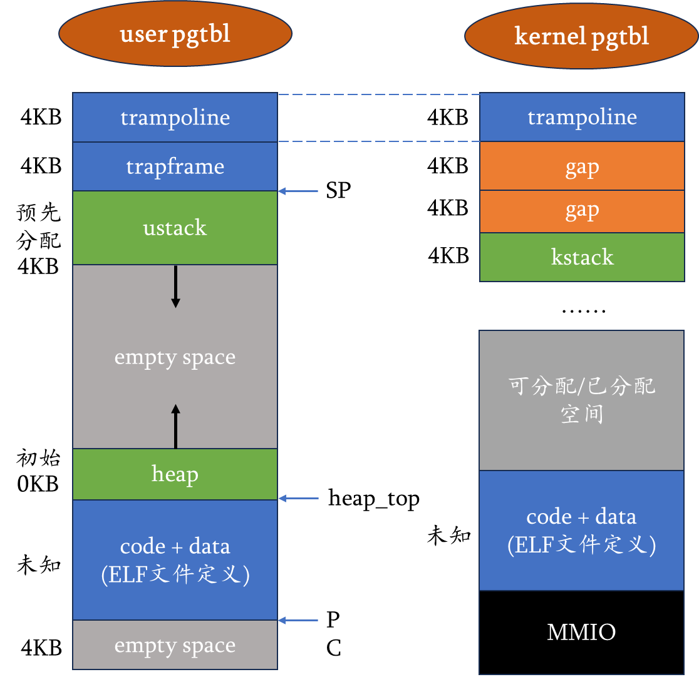

# LAB-4: 第一个用户进程的诞生

**前言**

LAB-1到LAB-3属于第一阶段: **基础设施建设**

从LAB-4开始, OS内核的构建进入第二阶段: **用户进程管理**

到目前为止, OS内核只是一个能够掌控硬件的高权限(S-mode)程序

然而, 内核最核心的作用其实是为低权限的用户进程提供安全、共享、便捷的系统服务

引入进程模块并不是一件简单的事情, 你是否也感到无从下手呢?

按照"从简单到复杂"的基本原则, 我们先来研究"第一个用户进程是怎么一步步诞生的"

本次实验的**核心目标**: 用户进程向内核发出一个syscall, 内核收到后输出`proczero: hello world\n`进行响应

## 代码组织结构

```
ECNU-OSLAB-2025-TASK
├── LICENSE        开源协议
├── .vscode        配置了可视化调试环境
├── registers.xml  配置了可视化调试环境
├── .gdbinit.tmp-riscv xv6自带的调试配置
├── common.mk      Makefile中一些工具链的定义
├── Makefile       编译运行整个项目
├── kernel.ld      定义了内核程序在链接时的布局 (CHANGE, 支持trampsec)
├── pictures       README使用的图片目录 (CHANGE, 日常更新)
├── README.md      实验指导书 (CHANGE, 日常更新)
└── src            源码
    ├── kernel     内核源码
    │   ├── arch   RISC-V相关
    │   │   ├── method.h
    │   │   ├── mod.h
    │   │   └── type.h
    │   ├── boot   机器启动
    │   │   ├── entry.S
    │   │   └── start.c
    │   ├── lock   锁机制
    │   │   ├── spinlock.c
    │   │   ├── method.h
    │   │   ├── mod.h
    │   │   └── type.h
    │   ├── lib    常用库
    │   │   ├── cpu.c (CHANGE, 新增myproc函数)
    │   │   ├── print.c
    │   │   ├── uart.c
    │   │   ├── utils.c
    │   │   ├── method.h (CHANGE, 新增myproc函数)
    │   │   ├── mod.h
    │   │   └── type.h (CHANGE, 扩充CPU结构体 + 帮助)
    │   ├── mem    内存模块
    │   │   ├── pmem.c
    │   │   ├── kvm.c (TODO, 增加内核页表的映射内容 trampoline + KSTACK(0))
    │   │   ├── method.h
    │   │   ├── mod.h
    │   │   └── type.h
    │   ├── trap   陷阱模块
    │   │   ├── plic.c
    │   │   ├── timer.c
    │   │   ├── trap_kernel.c
    │   │   ├── trap_user.c (TODO, 用户态陷阱处理)
    │   │   ├── trap.S
    │   │   ├── trampoline.S
    │   │   ├── method.h (CHANGE, 增加函数定义)
    │   │   ├── mod.h
    │   │   └── type.h
    │   ├── proc   进程模块
    │   │   ├── proc.c (TODO, 进程管理核心逻辑)
    │   │   ├── swtch.S (NEW, 上下文切换)
    │   │   ├── method.h (NEW)
    │   │   ├── mod.h (NEW)
    │   │   └── type.h (NEW)
    │   └── main.c (CHANGE, 日常更新)
    └── user       用户程序
        ├── initcode.c (NEW)
        ├── sys.h (NEW)
        ├── syscall_arch.h (NEW)
        └── syscall_num.h (NEW)
```

**标记说明**

**NEW**: 新增源文件, 直接拷贝即可, 无需修改

**CHANGE**: 旧的源文件发生了更新, 直接拷贝即可, 无需修改

**TODO**: 你需要实现新功能 / 你需要完善旧功能

## 进程的定义和地址空间布局

### 用户进程诞生之前

进程指的是一个具备运行状态的程序(在Linux环境下就是ELF文件)

也就是说进程由静态的可执行文件 + 动态的执行状态构成 (寄存器上下文、内存占用等)

在某种意义上, OS内核本身也可以视为一种进程 (它符合进程的定义, 虽然一般不叫它进程)

用户进程诞生之前, OS内核基于**boot/start.c**中定义的函数栈`CPU_stack`+**mem/kvm.c**中定义的`kernel_pgtbl`运行

它的主逻辑位于**main.c**, 进行了一系列系统资源初始化, 随后执行死循环`while(1)`, 期间穿插trap的中断异常处理过程

这就是用户进程诞生之前OS内核的状态

### 用户进程的定义

这启发我们, 用户进程也至少要有**用户栈 + 用户页表**来支持它的运行

除此之外, 用户进程还需要记录哪些信息呢?

- 与**用户栈**对应的连续内存空间——**用户堆**

- 用户进程陷入内核后, 需要有临时的函数执行空间——**内核栈**

- 用户进程陷入内核前, 必须保存用户执行流的上下文——**trapframe**

- 用户进程在内核中发生切换, 必须保存内核执行流的上下文——**context**

- 用户进程应该有一个自己的代号——**pid**

```c
// 进程
typedef struct proc
{
    int pid; // 标识符

    pgtbl_t pgtbl;       // 用户态页表
    uint64 heap_top;     // 用户堆顶(以字节为单位)
    uint64 ustack_npage; // 用户栈占用的页面数量
    trapframe_t *tf;     // 用户态内核态切换时的运行环境暂存空间

    uint64 kstack;       // 内核栈的虚拟地址
    context_t ctx;       // 内核态进程上下文
} proc_t;
```

### 用户进程的地址空间



图片显示了用户页表定义的用户进程地址空间 + 内核页表定义的内核程序地址空间

为了让用户程序顺利陷入内核执行, 内核页表在初始化时需要多映射以下两个部分

- **trampoline**: 定义在**trap/trampoline.S**, 是U-mode进入S-mode的代码逻辑

- **kstack**: 宏`KSTACK(procid)` 定义了各个进程的内核栈地址空间, 目前只需映射proczero (procid = 0)

除此之外, `main`在完成初始化工作后会调用`proc_make_first`来准备proczero的初始状态

proczero的初始化流程如下:

- 设置pid、申请trapframe的物理页、申请用户页表(顺便完成trampoline和trapframe的映射)

- 申请ustack的物理页并完成映射、设置ustack_npage和heap_top

- 为ELF文件(code + data)申请一个物理页、进行数据转移、完成映射

- 设置trapframe中的user_to_kern_epc (返回后被置为PC)、sp

- 设置内核相关的kstack、ctx.ra、ctx.sp字段 (以便下次回到内核)

- 通过swtch完成上下文切换

**值得注意的问题: 用户程序的ELF文件从哪来?**

Makefile中QEMU启动的部分, 我们传递给QEMU的参数是内核的可执行文件**kernel-qemu.elf**

因此, 可以推断proczero对应的**initcode.elf**一定会以某种方式嵌入**kernel-qemu.elf**

注意到**proc/proc.c**的头文件中有这样的代码

```c
#include "../../user/initcode.h"

#define initcode target_user_initcode
#define initcode_len target_user_initcode_len
```

它引用了**user/initcode.h**, 里面有一个长度为`initcode_len`的`initcode`数组

这个数组其实就是ELF文件, 只是以数组的形式存储, 它的本体是 **user/initcode.c**

修改**user/initcode.c**后执行 `make clean` + `make qemu` 就能将新的**initcode**同步到内核

**initcode.h**的生成过程参见**Makefile**的有关逻辑, 这里不做详细介绍

## 特权级内上下文切换 (context)

让我们聚焦`proc_make_first`函数的最后一步: swtch(old_context, new_context)

`swtch`函数定义在**proc/swtch.S**中, 它的作用是将若干寄存器的值存入内存区域A, 再将内存区域B的值写入寄存器

获得寄存器的使用权意味着新的执行流开始工作, 失去寄存器的使用权意味着旧的执行流暂停执行

在`proc_make_first`里, 新的执行流是proczero, 旧的执行流是OS内核本身(entry.S->start.c->main.c->proc_make_first)

新执行流存储寄存器的内存区域是`proc->context`, 旧的执行流呢?

注意到旧的执行流数量和CPU数量相等, 它们的栈被定义为`uint8 CPU_stack[4096 * NCPU]`

因此, 我们只需要在`struct cpu`中增加一个`struct context`字段即可

另外, 还需要增加`struct proc*`来标识当前CPU执行的是哪个用户进程, 通过`myproc()`暴露给外界

## 特权级间上下文切换 (trapframe)

书接上文, `proc_make_first`在执行`swtch`之前会将`proczero.context.ra`设置为`trap_user_return`

这提醒我们追随proczero的执行流, 将注意力从**proc.c**转移到**trap_user.c**和**trampoline.S**

待续......

## 用户态陷阱处理

## 测试
