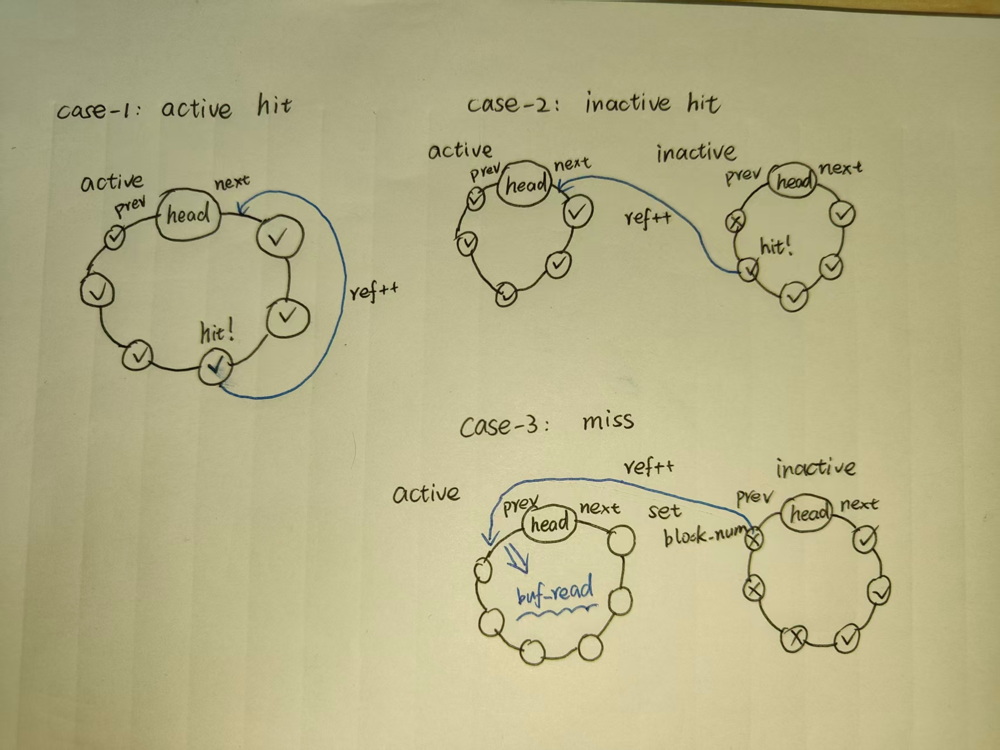
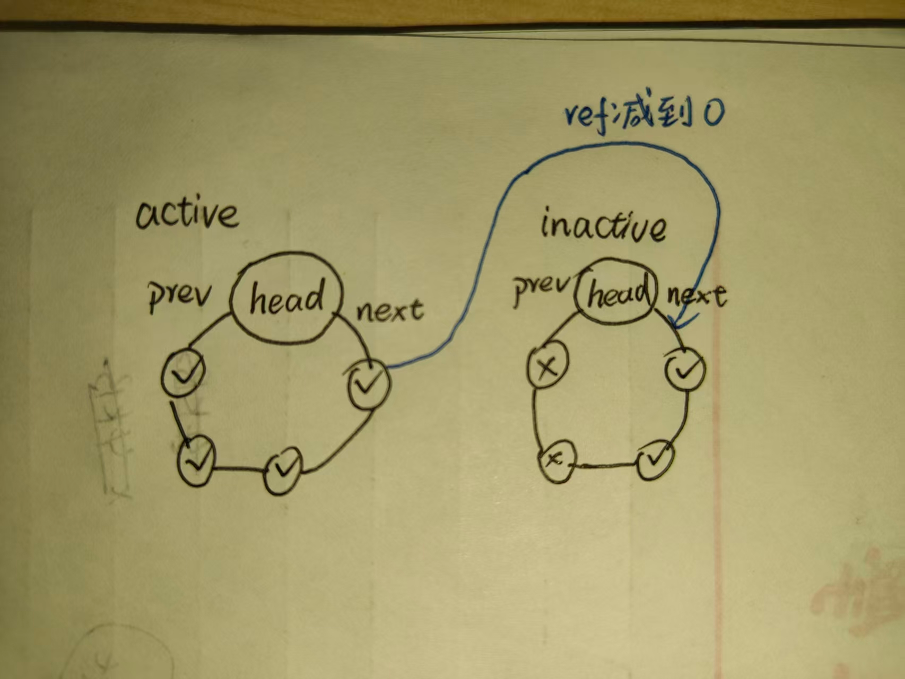

# LAB-7: 文件系统 之 磁盘管理

**前言**

本次实验我们将围绕磁盘管理构建文件系统的基础设施

1. 首先讨论QEMU启动时的输入参数disk.img是如何构建的

2. 随后讨论以block为基本单位的磁盘读写如何实现, 包括驱动本身+OS提供的配合

3. 随后讨论磁盘与内存进行数据交换的桥梁--缓冲系统(buffer)

4. 最后讨论磁盘上bitmap区域的管理方法

## 代码组织结构

```
ECNU-OSLAB-2025-TASK
├── LICENSE        开源协议
├── .vscode        配置了可视化调试环境
├── registers.xml  配置了可视化调试环境
├── .gdbinit.tmp-riscv xv6自带的调试配置
├── common.mk      Makefile中一些工具链的定义
├── Makefile       编译运行整个项目 (CHANGE)
├── kernel.ld      定义了内核程序在链接时的布局
├── pictures       README使用的图片目录 (CHANGE, 日常更新)
├── README.md      实验指导书 (CHANGE, 日常更新)
└── src            源码
    ├── kernel     内核源码
    │   ├── arch   RISC-V相关
    │   │   ├── method.h
    │   │   ├── mod.h
    │   │   └── type.h
    │   ├── boot   机器启动
    │   │   ├── entry.S
    │   │   └── start.c
    │   ├── lock   锁机制
    │   │   ├── spinlock.c
    │   │   ├── sleeplock.c
    │   │   ├── method.h
    │   │   ├── mod.h
    │   │   └── type.h
    │   ├── lib    常用库
    │   │   ├── cpu.c
    │   │   ├── print.c
    │   │   ├── uart.c
    │   │   ├── utils.c
    │   │   ├── method.h
    │   │   ├── mod.h
    │   │   └── type.h
    │   ├── mem    内存模块
    │   │   ├── pmem.c
    │   │   ├── kvm.c (TODO, 内核页表增加磁盘相关映射 + vm_getpte处理pgtbl为NULL的情况)
    │   │   ├── uvm.c
    │   │   ├── mmap.c
    │   │   ├── method.h
    │   │   ├── mod.h
    │   │   └── type.h
    │   ├── trap   陷阱模块
    │   │   ├── plic.c (TODO, 增加磁盘中断相关支持)
    │   │   ├── timer.c
    │   │   ├── trap_kernel.c (TODO, 在外设处理函数中识别和响应磁盘中断)
    │   │   ├── trap_user.c
    │   │   ├── trap.S
    │   │   ├── trampoline.S
    │   │   ├── method.h
    │   │   ├── mod.h (CHANGE, include 文件系统模块)
    │   │   └── type.h
    │   ├── proc   进程模块
    │   │   ├── proc.c (在proc_return中调用文件系统初始化函数)
    │   │   ├── swtch.S
    │   │   ├── method.h
    │   │   ├── mod.h (CHANGE, include 文件系统模块)
    │   │   └── type.h
    │   ├── syscall 系统调用模块
    │   │   ├── syscall.c (TODO, 新增系统调用)
    │   │   ├── sysfunc.c (TODO, 新增系统调用)
    │   │   ├── method.h (CHANGE, 新增系统调用)
    │   │   ├── mod.h (CHANGE, include文件系统模块)
    │   │   └── type.h (CHANGE, 新增系统调用)
    │   ├── fs     文件系统模块
    │   │   ├── bitmap.c (TODO, bitmap相关操作)
    │   │   ├── buffer.c (TODO, 内存中的block缓冲区管理)
    │   │   ├── fs.c (TODO, 文件系统相关)
    │   │   ├── virtio.c (NEW, 虚拟磁盘的驱动)
    │   │   ├── method.h (NEW)
    │   │   ├── mod.h (NEW)
    │   │   └── type.h (NEW)
    │   └── main.c (CHANGE, 增加virtio_init)
    ├── mkfs       磁盘映像初始化
    │   ├── mkfs.c (NEW)
    │   └── mkfs.h (NEW)
    └── user       用户程序
        ├── initcode.c (CHANGE, 日常更新)
        ├── sys.h
        ├── syscall_arch.h
        └── syscall_num.h (CHANGE, 日常更新)
```

**标记说明**

**NEW**: 新增源文件, 直接拷贝即可, 无需修改

**CHANGE**: 旧的源文件发生了更新, 直接拷贝即可, 无需修改

**TODO**: 你需要实现新功能 / 你需要完善旧功能

## 磁盘的初始状态--disk.img如何构建

要引入磁盘这种新的外设肯定离不开QEMU的支持, 我们在**QEMUOPTS**增加了这样的两行:

```
QEMUOPTS += -drive file=$(DISKIMG),if=none,format=raw,id=x0 # 初始磁盘映像
QEMUOPTS += -device virtio-blk-device,drive=x0,bus=virtio-mmio-bus.0 # 虚拟磁盘设备
```

它定义了磁盘在启动时的初始状态为disk.img, 同时启动了一个虚拟磁盘设备作为disk.img的载体

**disk.img不是凭空产生的,它是如何构建的呢？**

请你关注**mkfs/mkfs.c**和**mkfs/mkfs.h**源文件

简单来说, 它负责创建和打开一个文件, 并向这个文件写入一些信息进行文件系统格式化

通过`open + lseek + write + close`这组常见的文件接口来实现 (注意, 它不是基于我们实现的内核, 而是Linux)

具体来说, 磁盘可以被看作以block为基本单位的长数组, **mkfs.h**规定了磁盘布局结构如下:

**[ superblock | inode bitmap | inode region | data bitmap | data region ]**

- block是磁盘的基本逻辑单位, 磁盘由若干block构成, block的大小规定为**BLOCK_SIZE**, 这里与**PAGE_SIZE**保持一致

- 第1部分由**1个**block构成, 被称为超级块, 记录了文件系统和磁盘的相关信息(布局、魔数、块大小等), 是最重要的元数据

- 第2、3部分描述文件系统元数据, 第4、5部分描述文件系统数据, 他们都是**element_bitmap + element_region**的结构

- 第3部分包括N个inode, 第2部分描述第3部分各个inode元素是否分配出去了 (bit为1代表已分配, bit为0代表未分配)

- 第5部分包括M个data block, 第4部分描述第5部分各个data block元素是否分配出去了 (bit为1代表已分配, bit为0代表未分配)

通过修改**N_INODE**和**N_DATA_BLOCK**, 我们可以控制元数据资源池和数据资源池的大小, 进而影响disk.img的大小

初始化结束后, disk.img中的**superblock**完成了设置, **inode bitmap**和**data bitmap**全部清零

注意: 在本次实验中, 你只需要知道**inode region**是一个区别于**data region**的区域即可, 不需要对inode有细致了解

## 构建block-level的读写能力

构建disk.img后, 我们还需要构建读写它的基本能力, 才能实现数据的持久化存储

前面提到过, 磁盘的基本管理单位是block, 因此我们首先考虑如何构建block-level的读写能力

我们之前学习过另一种具备读写能力的外设--UART(串口), 可以获得以下启示:

- 需要**磁盘驱动程序**, 通过一系列寄存器操作实现读写能力

- 需要与OS的陷阱子系统密切配合, 实现中断响应函数 (磁盘操作很费时, 必须采用中断方式)

**1. 首先讨论磁盘驱动程序的部分 (了解即可)**

驱动程序非常复杂, 且和设备寄存器耦合严密, 不是学习的重点, 只需要知道它提供的接口即可

请你查看**kernel/fs/virtio.c**源文件, 它包括以下几个函数:

```c
/* virtio.c: 以block为单位的磁盘读写能力 */

void virtio_disk_init(); // 磁盘初始化
void virtio_disk_rw(buffer_t *b, bool write); // 磁盘读写
void virtio_disk_intr(); // 磁盘中断处理
```

- `virtio_disk_init`与磁盘进行通信并让它进入READY状态

- `virtio_disk_rw`提供了以block为单位的读写能力, 供buffer子系统使用

- `virtio_disk_intr`是磁盘中断处理流程, 当磁盘完成一次I/O时会通过中断系统提醒OS, 唤醒等待磁盘资源的进程

**2. 再讨论OS如何与磁盘驱动配合 (需要你做)**

- 系统初始化(**main.c**): 在合适的位置增加虚拟磁盘初始化的逻辑

- 内存系统(**pmem.c**): 需要在内核页表初始化时, 完成磁盘相关寄存器的映射工作

- 内存系统(**pmem.c**): `virtion_disk_rw`中调用了`vm_getpte`进行地址翻译, 但是无法将页表参数设为内核页表(它是static的), 所以传入了NULL代表需要使用内核页表进行翻译, 需要修改`vm_getpte`来处理这种情况

- 陷阱系统(**plic.c**): 使能磁盘中断并设置磁盘中断的优先级

- 陷阱系统(**trap_kernel.c**): 在外设中断处理流程中增加磁盘中断的处理分支

## 建立磁盘与内存的数据交换桥梁--缓冲系统 (buffer)

```c
/* 以Block为单位在内存和磁盘间传递数据 */
typedef struct buffer {
    /*
        锁的说明:
        1. block_num和ref由全局的自旋锁lk_buf_cache保护
        2. data和disk由内部的睡眠锁slk保护
    */
    uint32 block_num;                // buffer对应的磁盘内block序号 
    uint32 ref;                      // 引用数 (该buffer被get的次数)
    sleeplock_t slk;                 // 睡眠锁
    uint8* data;                     // block数据(大小为BLOCK_SIZE)
    bool disk;                       // 在virtio.c中使用
} buffer_t;
```

首先, 数据要从内存写入磁盘, 需要将内存缓冲区与磁盘中block的序号进行绑定, 指导`virtio_disk_rw`的工作

因此, **buffer_t**需要包括**uint32 block_num**和**uint8* data**来记录这种绑定关系

此外, 磁盘是共享资源, 可能有多个进程同时访问一个block的情况

因此, 需要引入睡眠锁**slk**保证高效的有序访问, 引入计数器**ref**防止过早释放资源

最后, 需要增加一个**disk**字段供**virtio.c**使用, 这里不做解释

```c
static buffer_node_t buf_cache[N_BUFFER];
static buffer_node_t buf_head_active, buf_head_inactive;
static spinlock_t lk_buf_cache;
```

类似之前**mmap**的管理方式, **buffer结构体资源**被组织为两个带头节点的双向循环链表

**1. 资源初始化 (buffer_init)**

非活跃链表(以**buf_head_inactive**为头节点)中所有元素的ref都等于0 (无人引用)

活跃链表(以**buf_head_inactive**为头节点)中所有元素的ref都大于0 (有人引用)

因此, 在初始化时, buf_cache中所有buffer的ref设为0, block_num设为**BLOCK_NUM_UNUSED**

随后, 将所有初始化的buffer插入非活跃链表 (我们希望第一个buffer最后位于buf_head_inactive->next)

**2. 资源获取 (buffer_get)**

buffer在链表间/链表内的移动遵守LRU原则: 最活跃的资源位于head->next, 最不活跃的资源位于head->prev



当上层尝试获取某个block对应的buffer时(如图片所示):

- 我们首先尝试在活跃链表中寻找 (从head->next开始), 找到后将它移动到活跃链表的head->next

- 如果找不到则尝试在不活跃链表中开始寻找 (从head->next开始), 找到后将它移动到活跃链表的head->next

- 如果还是找不到, 说明缓存失败: 将系统中最不活跃的buffer拿出来, 设置block_num, 移动到活跃链表的head->prev

如果buffer hit, 只需上锁后返回; 如果buffer miss, 上锁后需要先去磁盘中读入目标block

注意: 通过buffer_get获取的buffer, 对应的ref应该+1, 记录被使用的次数

**3. 资源释放 (buffer_put)**

buffer释放时ref应该-1, 如果减到0, 则移动到不活跃链表的head->next



**4. 关于buffer控制的物理内存的申请和释放**

我们按照自动申请, 手动释放的原则管理buffer控制的物理内存资源 (大小为BLOCK_SIZE, 与物理页一样大)

具体来说:

- 在`buf_get`获取不活跃链表中的元素时, 检查buf->data是否为NULL, 是的话申请一个物理页

- 在`buf_freemem`中扫描不活跃链表中的若干最不活跃元素, 尝试释放buffer_count个物理页

**5. 基于buffer的block读写**

`buffer_read` 和 `buffer_write` 的底层都是 `virtio_disk_rw`

只是在此基础上增加了睡眠锁检查, 确保调用者持有锁后才能进入耗时的磁盘操作

**6. 典型的buffer使用方法**

```c
/* 常规流程 */ 
buffer_t* buf = buf_get(block_num);
do_something_in_buf_data();
buf_write(buf); // 也可以只读不修改
buf_put(block_num);

/* 一段时间后可能存在大量无用缓存 */
buf_freemem(N_BUFFER);

```

## 使用buffer: 读入superblock

让我们来利用刚刚建立的缓冲系统做点重要的事情: 读入超级块

**首先考虑读入的时机: 可以在main函数中完成吗?**

不能, 因为磁盘读入会触发`proc_sleep`和`proc_wakeup`

所以需要在用户进程的上下文中执行, 而不是在初始化过程中执行

**什么时刻是最早的时机呢?**

初始化过程中通过`proc_make_first`准备好了**proczero**, 并将它的context->ra设为`proc_return`

之后初始化过程进入调度器逻辑(`proc_scheduler`), 将控制流切换到**proczero**

因此, 最早的时机就是**proczero**第一次进入`proc_return`时!

我们在这里调用`fs_init`进行文件系统初始化, 目前主要用于初始化缓冲系统和读入superblock

考虑到debug的方便性, 请在读入superblock后输出磁盘布局信息 (通过`sb_print`)

## 使用buffer: bitmap管理

bitmap的管理以bit为基本粒度, 因此需要单独开辟一套管理逻辑

- 当申请一个data block或inode时, 对应bitmap的某个bit被置为1

- 当释放一个data block或inode时, 对应bitmap的对应bit被置为0

请你基于buffer来实现以下函数:

```c
uint32 bitmap_alloc_block();
uint32 bitmap_alloc_inode();
void bitmap_free_block(uint32 block_num);
void bitmap_free_inode(uint32 inode_num);
```

**它们的共同逻辑:**

- `bitmap_search_and_set`: 在1个bitmap_block中从头先后扫描bit流, 找到第一个为0的bit, 设置为1并返回索引号

- `bitmap_clear`: 将bitmap_block中的某个bit设为0

**需要注意的问题:**

- bitmap区域可能横跨多个block, 寻找空闲bit时需要遍历

- bitmap区域的最后一个block可能只用了一部分, 寻找空闲bit时需要传入有效范围

- 细心一点, 可以通过逐字节遍历和逐bit位运算来寻找空闲bit

## 增加系统调用

我们需要增加以下11个系统调用的支持, 以支持后面的用户态测试用例

```c
#define SYS_alloc_block 11  // 从data_bitmap申请1个block (测试data_bitmap_alloc)
#define SYS_free_block 12   // 向data_bitmap释放1个block (测试data_bitmap_free)
#define SYS_alloc_inode 13  // 从inode_bitmap申请1个inode (测试inode_bitmap_alloc)
#define SYS_free_inode 14   // 向inode_bitmap释放1个inode (测试inode_bitmap_free)
#define SYS_show_bitmap 15  // 输出目标bitmap的状态
#define SYS_get_block 16    // 获取1个描述block的buffer (测试buffer_get)
#define SYS_read_block 17   // 将buf->data拷贝到用户空间
#define SYS_write_block 18  // 基于用户地址空间更新buffer->data并写入磁盘 (测试buffer_write)
#define SYS_put_block 19    // 释放1个描述block的buffer (测试buffer_put)
#define SYS_show_buffer 20  // 输出buffer链表的状态
#define SYS_flush_buffer 21 // 释放非活跃链表中buffer持有的物理内存资源 (测试buffer_freemem)
```

请你结合**kernel/sycall/sysfunc.c**的注释和后面给出的测试用例来理解这些系统调用的输入输出

几乎都是先做参数读取, 然后调用对应的实现函数, 请你实现这些系统调用, 这里不做详细介绍

## 测试用例

测试开始前, 请将**N_BUFFER**从(32 * 512)改成**N_BUFFER_TEST**, 方便测试

测试用例包括三个部分:

1. 什么都不做, 测试superblock信息能否正常输出, 检验磁盘和缓冲系统的基本能力

2. 测试bitmap中资源申请和释放的正确性

3. 测试缓冲系统的LRU管理逻辑是否生效

**test-1**

```c
// test-1: read superblock
#include "sys.h"

int main()
{
	syscall(SYS_print_str, "hello, world!\n");
	while(1);
}
```

理想测试结果见`./picture/test-1.png`

**test-2**

```c
// test-2: bitmap
#include "sys.h"

#define NUM 20
#define N_BUFFER 8

int main()
{
	unsigned int block_num[NUM];
	unsigned int inode_num[NUM];

	for (int i = 0; i < NUM; i++)
		block_num[i] = syscall(SYS_alloc_block);

	syscall(SYS_flush_buffer, N_BUFFER);
	syscall(SYS_show_bitmap, 0);

	for (int i = 0; i < NUM; i+=2)
		syscall(SYS_free_block, block_num[i]);
	
	syscall(SYS_flush_buffer, N_BUFFER);
	syscall(SYS_show_bitmap, 0);

	for (int i = 1; i < NUM; i+=2)
		syscall(SYS_free_block, block_num[i]);

	syscall(SYS_flush_buffer, N_BUFFER);
	syscall(SYS_show_bitmap, 0);

	for (int i = 0; i < NUM; i++)
		inode_num[i] = syscall(SYS_alloc_inode);

	syscall(SYS_flush_buffer, N_BUFFER);
	syscall(SYS_show_bitmap, 1);

	for (int i = 0; i < NUM; i++)
		syscall(SYS_free_inode, inode_num[i]);

	syscall(SYS_flush_buffer, N_BUFFER);
	syscall(SYS_show_bitmap, 1);

	while(1);
}
```

理想测试结果见`./picture/test-2.png`

**test-3**

```c
#include "sys.h"

#define PGSIZE 4096
#define N_BUFFER 8
#define BLOCK_BASE 5000

int main()
{
	char data[PGSIZE], tmp[PGSIZE];
	unsigned long long buffer[N_BUFFER];

	/*-------------一阶段测试: READ WRITE------------- */

	/* 准备字符串"ABCDEFGH" */
	for (int i = 0; i < 8; i++)
		data[i] = 'A' + i;
	data[8] = '\n';
	data[9] = '\0';

	/* 查看此时的buffer_cache状态 */
	syscall(SYS_print_str, "\nstate-1 ");
	syscall(SYS_show_buffer);

	/* 向BLOCK_BASE写入字符 */
	buffer[0] = syscall(SYS_get_block, BLOCK_BASE);
	syscall(SYS_write_block, buffer[0], data);
	syscall(SYS_put_block, buffer[0]);

	/* 查看此时的buffer_cache状态 */
	syscall(SYS_print_str, "\nstate-2 ");
	syscall(SYS_show_buffer);

	/* 清空内存副本, 确保后面从磁盘中重新读取 */
	syscall(SYS_flush_buffer, N_BUFFER);

	/* 读取BLOCK_BASE*/
	buffer[0] = syscall(SYS_get_block, BLOCK_BASE);
	syscall(SYS_read_block, buffer[0], tmp);
	syscall(SYS_put_block, buffer[0]);

	/* 比较写入的字符串和读到的字符串 */
	syscall(SYS_print_str, "\n");
	syscall(SYS_print_str, "write data: ");
	syscall(SYS_print_str, data);
	syscall(SYS_print_str, "read data: ");
	syscall(SYS_print_str, tmp);

	/* 查看此时的buffer_cache状态 */
	syscall(SYS_print_str, "\nstate-3 ");
	syscall(SYS_show_buffer);

	/*-------------二阶段测试: GET PUT FLUSH------------- */
	
	/* GET */
	buffer[0] = syscall(SYS_get_block, BLOCK_BASE);
	buffer[3] = syscall(SYS_get_block, BLOCK_BASE + 3);
	buffer[7] = syscall(SYS_get_block, BLOCK_BASE + 7);
	buffer[2] = syscall(SYS_get_block, BLOCK_BASE + 2);
	buffer[4] = syscall(SYS_get_block, BLOCK_BASE + 4);

	/* 查看此时的buffer_cache状态 */
	syscall(SYS_print_str, "\nstate-4 ");
	syscall(SYS_show_buffer);

	/* PUT */
	syscall(SYS_put_block, buffer[7]);
	syscall(SYS_put_block, buffer[0]);
	syscall(SYS_put_block, buffer[4]);

	/* 查看此时的buffer_cache状态 */
	syscall(SYS_print_str, "\nstate-5 ");
	syscall(SYS_show_buffer);

	/* FLUSH */
	syscall(SYS_flush_buffer, 3);

	/* 查看此时的buffer_cache状态 */
	syscall(SYS_print_str, "\nstate-6 ");
	syscall(SYS_show_buffer);

	while(1);
}
```
理想测试结果见`./picture/test-3(1).png`和`./picture/test-3(2).png`

**尾声**

本次实验只是第三阶段的热身和铺垫~

我们引入了磁盘这种外设并具备了block-level的管理能力

在lab-8中, 我们要用inode将block组织起来并构建层次化的数据存储系统

我们即将进入真正的文件系统逻辑, 请你做好准备迎接新的挑战!